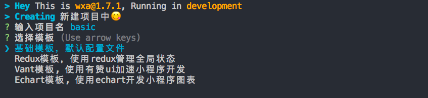

# 快速开始
wxa提供了一个方便好用的`cli`工具，使用cli可以从源站(目前是github)拉取手脚架，快速开始小程序开发。

::: warning 注意
请注意node.js版本 >= 8
:::

## 新建项目
### 1. 安装cli
```bash
# 全局安装@wxa/cli
npm i -g @wxa/cli2
``` 

### 2. 创建项目
```bash
# 在当前目录使用wxa-templates手脚架，创建helloWorld项目
wxa2 create 
```

按提示输入项目名，选择相应模板即可。如果下载失败了，可以从github上手动下载[模板](https://github.com/Genuifx/wxa-templates)使用。



进入项目目录，并安装依赖：
``` bash
cd basic && npm i
```

### 3. 编译项目
```bash
# watch模式编译项目
wxa2 build --watch
```

### 4. 从微信开发者工具打开
在微信开发者工具中填入小程序appid，把目录指向`path/to/helloWorld/dist`。然后就可以开始wxa项目开发了！

## 现有项目
原有的小程序项目可以不改动代码的情况下快速迁移到wxa下！只需要稍微加配置，旧的小程序项目一样可以享受`@wxa`提供的便利~

::: warning 注意
迁移项目到wxa前注意备份代码, 方便迁移失败回退。例如`git checkout -b backup`
:::

::: warning 注意
请注意node.js版本 >= 8
:::

### 1. 安装Cli
```bash
# 全局安装@wxa/cli
npm i -g @wxa/cli2
``` 

### 2. 安装项目依赖
::: warning 注意
如果之前没有接入`npm`，则先运行`npm init`初始化。
:::
```bash
# 打开项目目录
# cd path/to/your/project/

# 安装依赖
npm i @wxa/core @wxa/plugin-replace @wxa/plugin-uglifyjs @wxa/compiler-babel @wxa/compiler-sass babel-eslint @babel/preset-env @babel/plugin-transform-runtime @babel/runtime @babel/plugin-proposal-class-properties @babel/plugin-proposal-decorators cross-env 
```

### 2. 添加配置
添加`wxa.config.js`到项目目录 
```javascript
    const path = require('path');
    const UglifyjsPlugin = require('@wxa/plugin-uglifyjs');
    const ReplacePlugin = require('@wxa/plugin-replace');
    let prod = process.env.NODE_ENV === 'production';
    const env = process.env.NODE_ENV || 'development';

    // 生产和测试环境参数配置
    const envlist = require('./app.config')[env];
    module.exports = {
        // 指定微信开发者工具的目录，用于从cli调用其接口
        wechatwebdevtools: '/Applications/wechatwebdevtools.app',
        // 解析配置
        resolve: {
            alias: {
                '@': path.join(__dirname, 'src'),
            },
        },
        // 使用到的compiler
        use: [
            {
                test: /\.js$|\.wxs$/,
                name: 'babel',
                options: {
                    "sourceMap": false,
                    "presets": ["@babel/preset-env"],
                    "plugins": [
                        ["@babel/plugin-transform-runtime", {"corejs": false, "version": "7.1.2"}],
                        ["@babel/plugin-proposal-decorators", {"decoratorsBeforeExport": true}],
                        ["@babel/plugin-proposal-class-properties"]
                    ],
                    "ignore": [
                        "node_modules"
                    ]
                }
            }, {
                test: /\.sass$|\.scss$/,
                name: 'sass',
            }
        ],
        // 使用到的plugins
        plugins: [
            new ReplacePlugin({
                list: envlist,
            }),
        ],
    };
    if (prod) {
        module.exports.plugins.push(new UglifyjsPlugin());
    }
```

### 3. 编译项目
```bash
# watch模式编译项目
wxa2 build --watch
```

### 4. 从微信开发者工具打开
在微信开发者工具中填入小程序appid，把目录指向`path/to/your/project/dist`。然后就可以开始wxa项目开发了！
