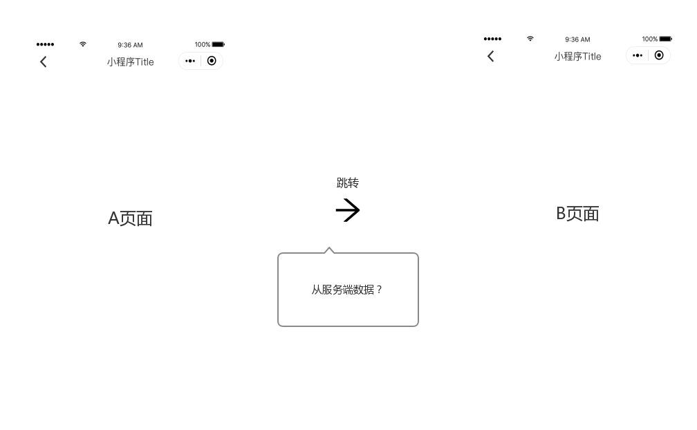

# 预加载

## 原理

就`web`而言，预加载精髓在于当页面渲染中需要一些JS或者CSS资源的时候，他们能够立即可用，如此一来减少了页面渲染的阻塞，使得页面切换显示更加流畅。在web中往往通过`rel=preload`实现：

``` html
<head>
  <meta charset="utf-8">
  <title>JS and CSS preload example</title>

  <link rel="preload" href="style.css" as="style">
  <link rel="preload" href="main.js" as="script">

  <link rel="stylesheet" href="style.css">
</head>

<body>
  <h1>bouncing balls</h1>
  <canvas></canvas>

  <script src="main.js"></script>
</body>
```

preload技术大量应用于`webpack`打包生成的应用中。需要更详细了解，可以查看[mdn](https://developer.mozilla.org/zh-CN/docs/Web/HTML/Preloading_content)

然而，在小程序中并非如此。当用户打开小程序的时候，微信就已经从服务器将完整的小程序代码包下载下来了。故而，web端的预加载概念并不适用于小程序开发中。

小程序的预加载主要应用于**页面的相互切换**之间。


在小程序运行时中，当从A页面跳转到B页面的时候，小程序需要实例化B页面，进行界面初始化渲染等操作，这里会有`100~200ms`的消耗。在小程序跳转完成之后，我们需要从服务器端拉取数据进行展示，用户需要继续等待数据，理想情况下（良好4G）一个查询请求只需要`100~300ms`就可以完成。也就是在不进行优化的情况下，用户最快也要等待200ms以上，页面内容才有意义。

仔细想想，其实数据拉取和小程序实例化两件事情其实并不耦合，并发去做两件事不就减少了很多时间？



所以，小程序预加载的其实就是**在页面跳转的同时去服务器端拉取数据**，达到一种页面刚跳转完成，用户直接看到了有效页面的效果。

## 实现
落地到wxa的话，我们可以借助[`beforeRouteEnter`](/core/hook.html#beforerouteenter)实现。

首先在B页面定义好拉取数据的逻辑：

``` js
// pages/b.wxa
import {Page, fetch} from '@wxa/core';

// 借助一个变量缓存
let handle;

@Page
export default class B {
  beforeRouteEnter() {
    // 注意 this 访问不到B实例，因为beforeRouteEnter执行的时候B还未实例化。
    handle = fetch('path/to/your/remote', {}, {});
  }

  async onLoad() {
    try {
      let info = await handle;

      // 增量设置数据。
      this.$diff({...info});
    } catch(e) {
      // 错误处理
      this.setData({showError: true});
    }
  }
} 
```

可以看到我们定义了一个`beforeRouteEnter`函数，并且在`beforeRouteEnter`中发起了一次请求，然后在`onLoad`的时候使用拉取的数据重新渲染页面。

::: warning beforeRouteEnter
注意`this`访问不到B实例，因为beforeRouteEnter执行的时候B还未实例化。
:::

接着我们利用`Router`提供的路由跳转能力从A跳转到B。

``` js
// pages/a.wxa
import {Page, Debounce} from '@wxa/core';

@Page
export default class A {
  @Debounce
  tap() {
    this.$router.push('./b');
  }
}
```

这样子就可以自动触发`beforeRouteEnter`的逻辑了~:sunglasses:

总结一下，预加载我们需要做好以下两点：
1. 利用`beforeRouteEnter`钩子定义好数据拉取逻辑。
2. 跳转的时候使用`Router`装饰器提供的方法触发。