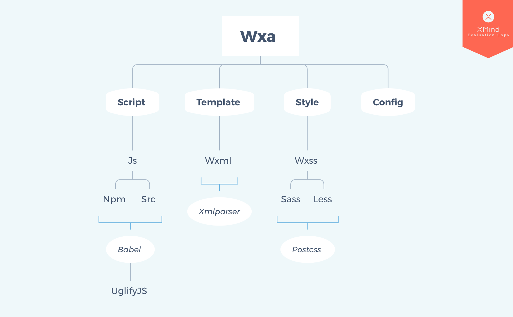

# wxa-cli
cli for wechat miniprogram developing.



# Installing
use `npm` for installing wxa.
`npm i -g @wxa/cli`

# Usage
1. basic build
`wxa build`

2. watch mode
`wxa build --watch`

3. build without cache
`wxa build --noCache`

# Feature
1. npm support
2. vue develop pattern
3. support multi plugins
4. support custom compiler

# configurations

core configs file is `wxa.config.js`, mostly like below:

```javascript
const path = require('path');
const UglifyjsPlugin = require('@wxa/plugin-uglifyjs');
const ReplacePlugin = require('@wxa/plugin-replace');
let prod = process.env.NODE_ENV === 'production';
const envlist = []; // your env configurations

module.exports = {
    resolve: {
        alias: {
            '@': path.join(__dirname, 'src'),
        },
    },
    use: ['babel', 'sass', 'stylus'],
    compilers: {
        sass: {
            // compiler options
        },
    },
    plugins: [
        new ReplacePlugin({
            list: envlist,
        }),
    ],
};

if (prod) {
    module.exports.plugins.push(new UglifyjsPlugin());
}

```

# Editor
use [vsCode](https://github.com/Microsoft/vscode) to make coding more enjoyable.
use [vetur](https://github.com/vuejs/vetur) for beautify `.wxa` file.
following vscode's configurations is recommended:
```json
{
    "javascript.implicitProjectConfig.experimentalDecorators": true,
    "vetur.grammar.customBlocks": {
    "config": "json"
  },
  "vetur.validation.template": false,
  "eslint.enable": true
}
```
and also a list of eslint configs:
```json
{
    "extends": [
        "./node_modules/eslint-config-google/index.js"
    ],
    "root": true,
    "env": {
        "commonjs": true,
        "es6": true,
        "node": true
    },
    "parser": "vue-eslint-parser",
    "parserOptions": {
        "parser": "babel-eslint",
        "ecmaFeatures": {
            "experimentalObjectRestSpread": true
        },
        "ecmaVersion": 2017,
        "sourceType": "module"
    },
    "rules": {
        "vue/valid-template-root": "off",
        "no-const-assign": "warn",
        "valid-template-root": "off",
        "no-this-before-super": "warn",
        "no-undef": "warn",
        "no-unreachable": "warn",
        "no-unused-vars": "warn",
        "constructor-super": "warn",
        "valid-typeof": "warn",
        "one-var": "warn",
        "max-len": "off",
        "no-trailing-spaces": "off",
        "require-jsdoc": "warn",
        "camelcase": "warn",
        "no-invalid-this": "warn",
        "new-cap": "warn",
        "guard-for-in": "warn"
    }
}
```
